# **MySQL**

*数据模型：关系型数据库**

● **关系型数据库****是建立在****关系模型****基础上的数据库,简单说,关系型数据库是由多张能互相连接的****二维表****组成的数据库**

优点：

1. 都是使用表结构,格式一致,易于维护。
2. 使用通用的SQL语言操作,使用方便,可用于复杂查询。
3. 数据存储在磁盘中,安全。

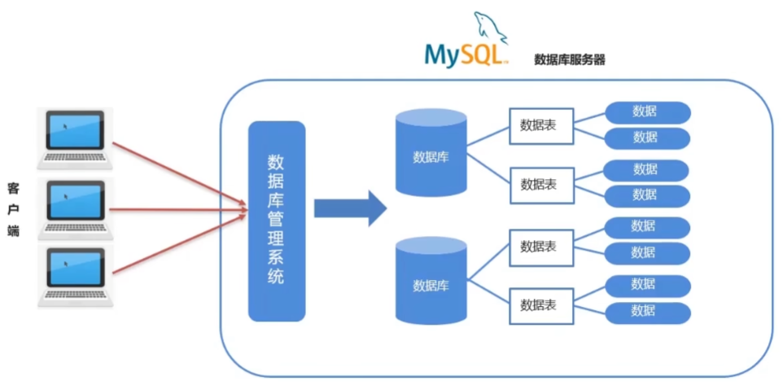

**SQL****通用语法**

1. SQL语句可以单行或多行书写,以分号结尾。
2. MySQL数据库的SQL语句**不区分大小写**,关键字建议使用大写。
3. 注释：
   1.  · 单行注释 :-- 注释内容 或**#注释内容(****MySQL** **特有)**

   2.  · 多行注释:/* 注释 */

## DDL

● DDL(Data Definition Language)数据定义语言,用来定义数据库对象:数据库,表,列等

### 操作数据库

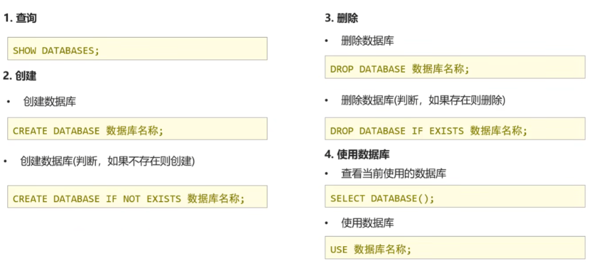 

### 操作表

#### **数据类型**

MySQL支持多种类型,可以分为三类:

1.数值

|              |         |                |
| ------------ | ------- | -------------- |
| 数据类型     | 大小    | 描述           |
| TINYINT      | 1 byte  | 小整数值       |
| SMALLINT     | 2 bytes | 大整数值       |
| MEDIUMINT    | 3 bytes | 大整数值       |
| INT或INTEGER | 4 bytes | 大整数值       |
| BIGINT       | 8 bytes | 极大整数值     |
| FLOAT        | 4 bytes | 单精度浮点数值 |
| DOUBLE       | 8 bytes | 双精度浮点数值 |
| DECIMAL      |         | 小数值         |

score double(总长度,小数点后保留的位数)    score double(5.2)

2.日期

 

3.字符串

 

#### 操作

 

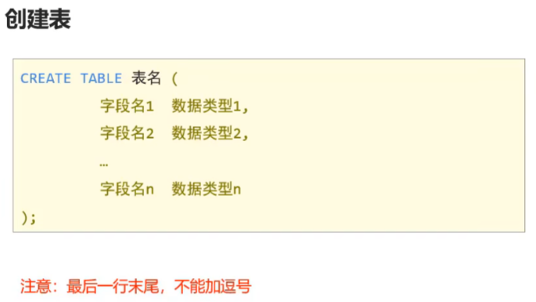 

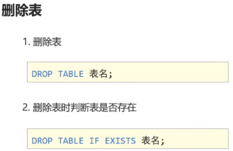  

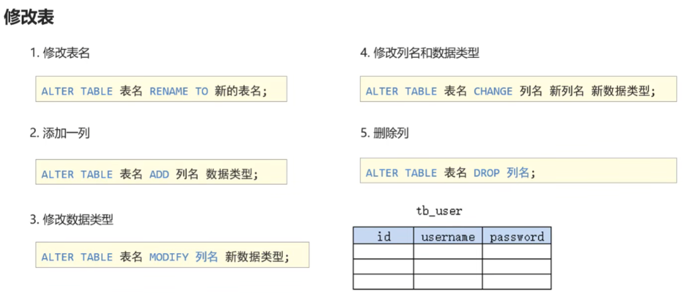  

## DML

● DML(Data Manipulation Language)数据操作语言,用来对数据库中表的数据进行增删改

**查询所有数据：**select * from 表名

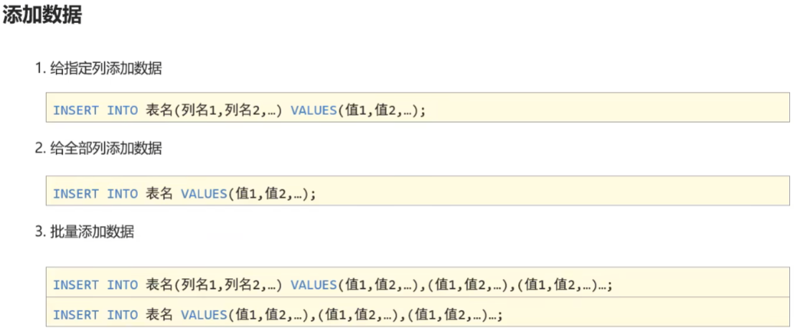 

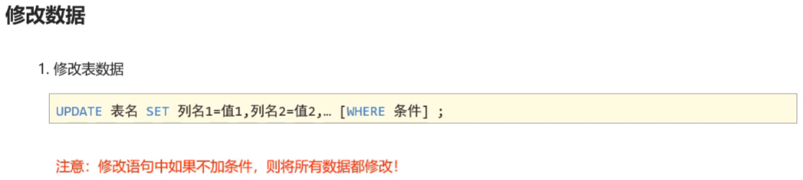 

例：update stu set sex='女’ where name=‘张三';

 

例：delete from stu where name = 'xx';

## DQL

● DQL(Data Query Language)数据查询语言,用来查询数据库中表的记录(数据)

#### 基础查询

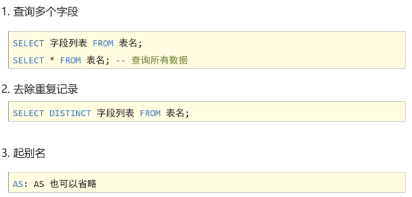 

#### 条件查询

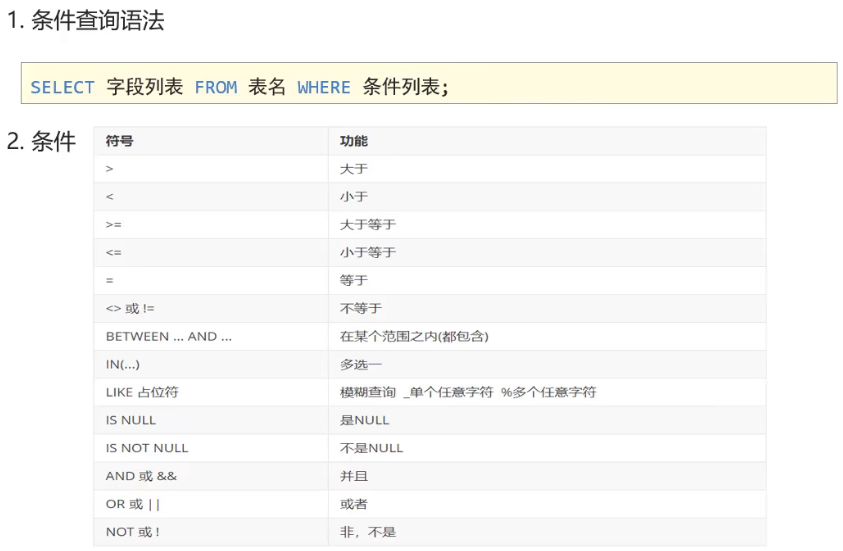 

#### 排序查询

#### 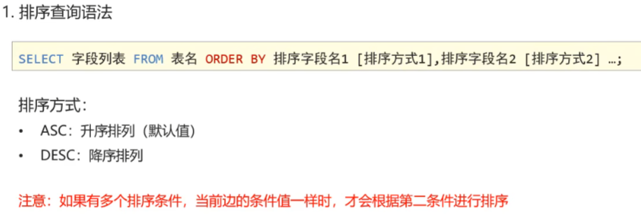

##### 聚合函数

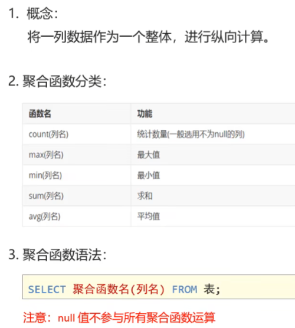 

##### 分组查询语法

! 

**例：**select sex, avg (math) , count (*) from stu where math > 70 group by sex having count (*)  > 2;

#### 分页查询

 

tips:

· 分页查询limit是MySQL数据库的方言

· Oracle 分页查询使用 rownumber

· SQL Server分页查询使用top

### DCL

● DCL(Data Control Language)数据控制语言,用来定义数据库的访问权限和安全级别,及创建用户

## 约束

### 约束的概念

· 约束是作用于表中列上的规则,用于限制加入表的数据

· 约束的存在保证了数据库中数据的正确性、有效性和完整性

### **约束的分类**

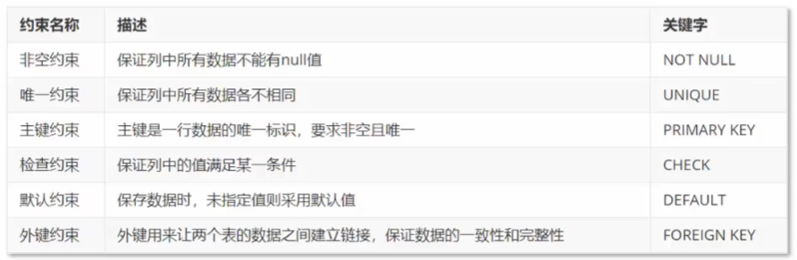 

Tips: MYSQL不支持检查约束，但是可以通过Java检查

#### 非空约束

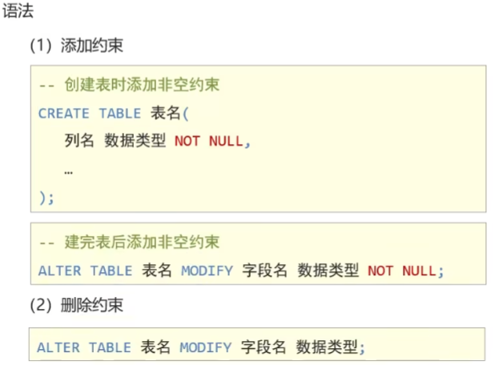  

#### 唯一约束

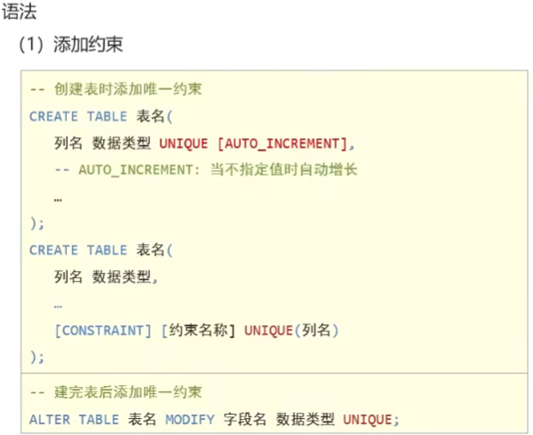 

 

#### 主键约束

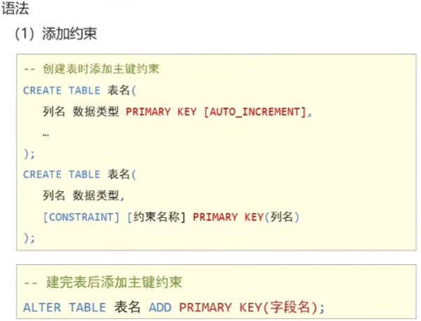 

  

#### 默认约束

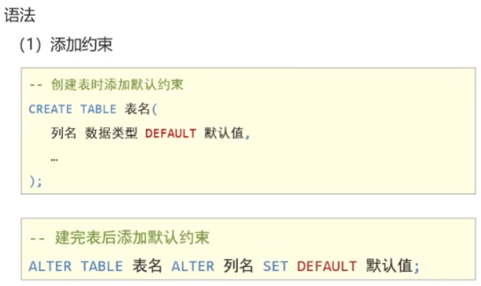 

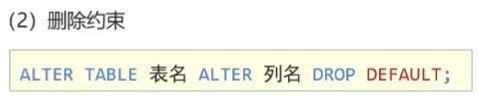 

#### 外键约束

**1.概念**

· 外键用来让两个表的数据之间建立链接,保证数据的一致性和完整性

###### 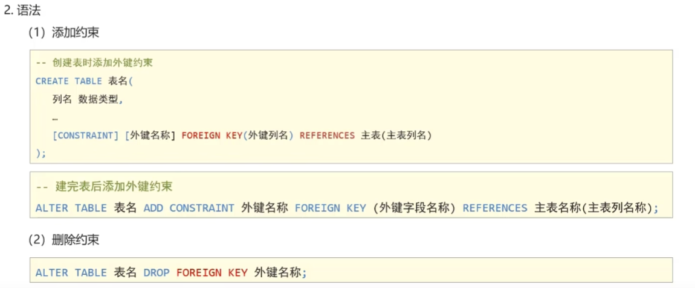 

[constraint] fk foreign key(dep_id) references (id)

## 数据库设计

**数据库设计设计什么?**

· 有哪些表

**·** 表里有哪些字段

**·** 表和表之间是什么关系

### **表关系**

#### 一对一

**如:用户 和 用户详情**

**一对一关系多用于表拆分,将一个实体中经常使用的字段放一张表,不经常使用的字段放另一张表,用于提升查询性能**

**实现方式:在任意一方加入外键,关联另一方主键,并且设置外键为唯一(UNIQUE)**

#### 一对多(多对一)

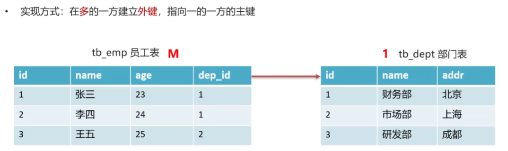

####  多对多

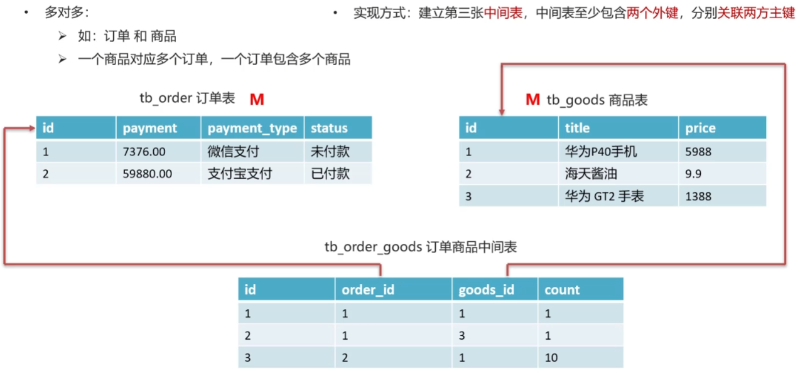 

**多表查询:从多张表查询数据**

### 内连接

相当于查询A B交集数据

  

### 外连接

左外连接:相当于查询A表所有数据和交集部分数据

右外连接:相当于查询B表所有数据和交集部分数据 

### 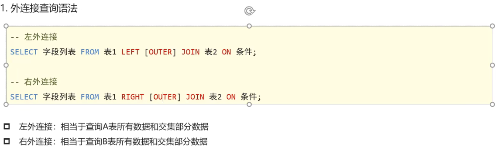

### 子查询

 

## JDBC

### DriverManager

DriverManager(驱动管理类)作用:

注册驱动（可省略）

获取数据库连接

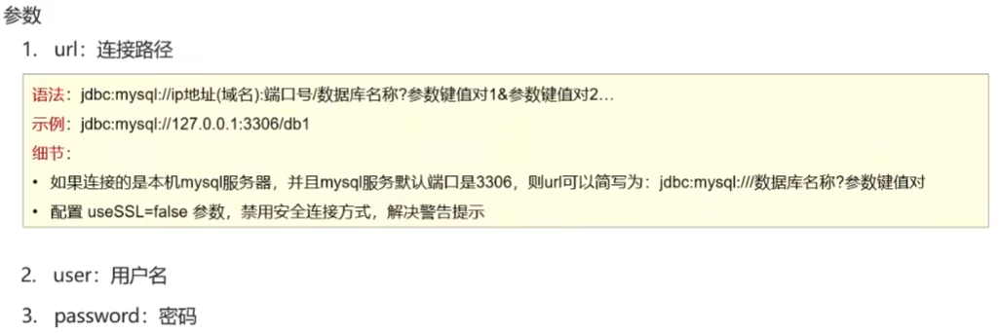 

### Connection

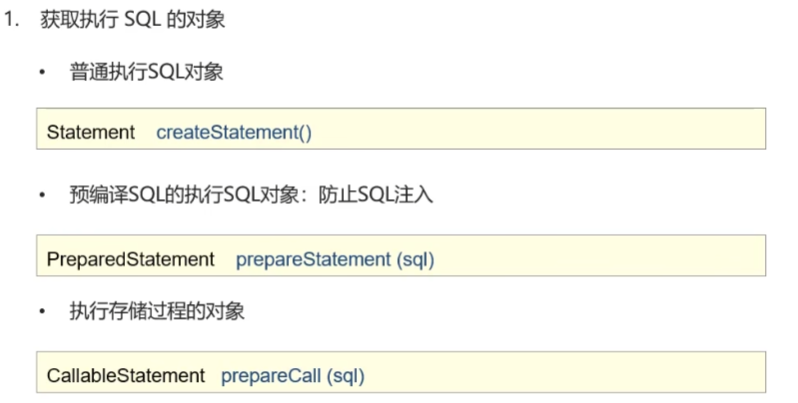 

事务管理

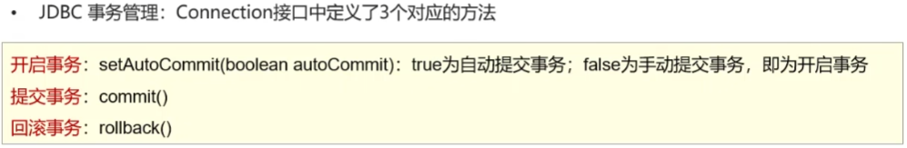 

**可以用try catch捕获异常然后回滚事务**

