# HTML

##  介绍

HTML 是一门语言，所有的网页都是用HTML 这门语言编写出来的，也就是HTML是用来写网页的

**HTML(HyperText Markup Language)：超文本标记语言：**

* 超文本：超越了文本的限制，比普通文本更强大。除了文字信息，还可以定义图片、音频、视频等内容

  如上图看到的页面，我们除了能看到一些文字，同时也有大量的图片展示；有些网页也有视频，音频等。这种展示效果超越了文本展示的限制。

* 标记语言：由标签构成的语言

  

## HTML 标签

### 结构标签


* HTML 标签不区分大小写

* HTML 标签属性值 单双引皆可

* HTML 语法松散

  


### 基础标签

基础标签就是一些和文字相关的标签，如下：

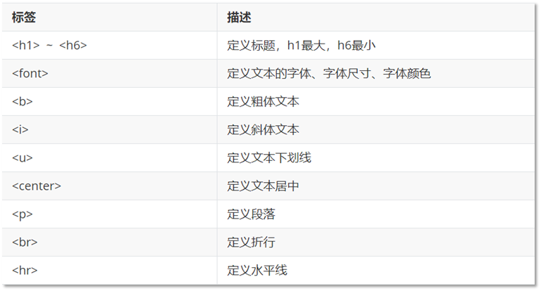 


#### 标题标签

标题标签中 h1最大，h6最小。

```html
<h1>我是标题 h1</h1>
<h2>我是标题 h2</h2>
<h3>我是标题 h3</h3>
<h4>我是标题 h4</h4>
<h5>我是标题 h5</h5>
<h6>我是标题 h6</h6>
```


#### hr标签

`hr` 标签在浏览器中呈现出 横线 的效果。


#### 字体标签

font：字体标签

* face 属性：用来设置字体。如 "楷体"、"宋体"等

* color 属性：设置文字颜色。颜色有三种表示方式

  * **英文单词**：red,pink,blue...

    这种方式表示的颜色特别有限，所以一般不用。

  * **rgb(值1,值2,值3)**：值的取值范围：0~255  

    此种方式也就是三原色（红绿蓝）设置方式。 例如： rgb(255,0,0)。

    这种书写起来比较麻烦，一般不用。

  * **#值1值2值3**：值的范围：00~FF

    这种方式是rgb方式的简化写法，以后基本都用此方式。

    值1表示红色的范围，值2表示绿色的范围，值3表示蓝色范围。例如： #ff0000

* size 属性：设置文字大小


####  加粗、斜体、下划线标签

* b：加粗标签
* i：斜体标签
* u：下划线标签，在文字的下方有一条横线

代码如下：

```html
<b>沙柳河水流淌</b><br>
<i>沙柳河水流淌</i><br>
<u>沙柳河水流淌</u><br>
```

在浏览器展示的效果如下：


#### 居中标签

center ：文本居中

代码如下：

```html
<hr>
<center>
    <b>沙柳河水流淌</b>
</center>
```

在浏览器效果如下：


####  

### 图片、音频、视频标签

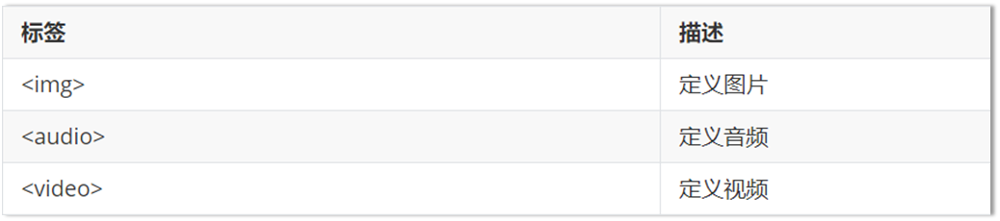

#### img：定义图片

* src：规定显示图像的 URL（统一资源定位符）

* height：定义图像的高度

* width：定义图像的宽度

#### audio：定义音频

支持的音频格式：MP3、WAV、OGG 

* src：规定音频的 URL

* controls：显示播放控件

#### video：定义视频

支持的音频格式：MP4, WebM、OGG

* src：规定视频的 URL
* controls：显示播放控件

**尺寸单位：**

height属性和width属性有两种设置方式：

* 像素：单位是px
* 百分比。占父标签的百分比。例如宽度设置为 50%，意思就是占它的父标签宽度的一般（50%）

**资源路径：**

图片，音频，视频标签都有src属性，而src是用来指定对应的图片，音频，视频文件的路径。此处的图片，音频，视频就称为资源。资源路径有如下两种设置方式：

* 绝对路径：完整路径

  这里的绝对路径是网络中的绝对路径。 格式为： 协议://ip地址:端口号/资源名称。

  

* 相对路径：相对位置关系

  找页面和其他资源的相对路径。

  > ./    表示当前路径
  >
  > ../   表示上一级路径
  >
  > ../../   表示上两级路径

  


###  超链接标签

  

`a` 标签属性：

* href：指定访问资源的URL 

* target：指定打开资源的方式
  * _self：默认值，在当前页面打开
  * _blank：在空白页面打开

**代码演示：**

```html
<!DOCTYPE html>
<html lang="en">
<head>
    <meta charset="UTF-8">
    <title>Title</title>
</head>
<body>
	<a href="https://www.itcast.cn" target="_self">点我有惊喜</a>
</body>
</html>
```


### 列表标签

HTML 中列表分为

#### 有序列表

如下图，页面效果中是有标号对每一项进行标记的。

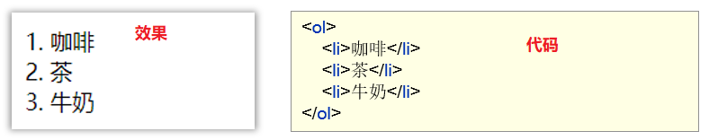

#### 无序列表

如下图，页面效果中没有标号对每一项进行标记，而是使用 点 进行标记。


**标签说明：**


有序列表中的 `type` 属性用来指定标记的标号的类型（数字、字母、罗马数字等）

无序列表中的 `type` 属性用来指定标记的形状

**代码演示：**

```html
<!DOCTYPE html>
<html lang="en">
<head>
    <meta charset="UTF-8">
    <title>Title</title>
</head>
<body>
    <ol type="A">
        <li>咖啡</li>
        <li>茶</li>
        <li>牛奶</li>
    </ol>
    
    <ul type="circle">
        <li>咖啡</li>
        <li>茶</li>
        <li>牛奶</li>
    </ul>
</body>
</html>
```


### 表格标签

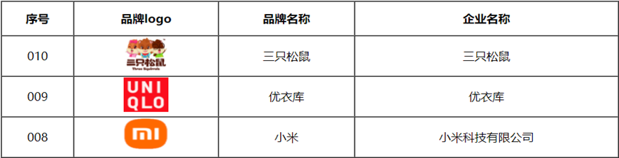

如上图就是一个表格，表格可以使用如下标签定义

* table ：定义表格

  * border：规定表格边框的宽度

  * width ：规定表格的宽度

  * cellspacing：规定单元格之间的空白

* tr ：定义行

  * align：定义表格行的内容对齐方式

* td ：定义单元格

  * rowspan:规定单元格可横跨的行数

  * colspan:规定单元格可横跨的列数

* th：定义表头单元格

**代码演示：**

```html
<!DOCTYPE html>
<html lang="en">
<head>
    <meta charset="UTF-8">
    <title>Title</title>
</head>
<body>

<table border="1" cellspacing="0" width="500">
    <tr>
        <th>序号</th>
        <th>品牌logo</th>
        <th>品牌名称</th>
        <th>企业名称</th>
    </tr>
    <tr align="center">
        <td>010</td>
        <td></td>
        <td>三只松鼠</td>
        <td>三只松鼠</td>
    </tr>

    <tr align="center">
        <td>009</td>
        <td></td>
        <td>优衣库</td>
        <td>优衣库</td>
    </tr>

    <tr align="center">
        <td>008</td>
        <td></td>
        <td>小米</td>
        <td>小米科技有限公司</td>
    </tr>
</table>
</body>
</html>
```


### 布局标签


这两个标签，一般都是和css结合到一块使用来实现页面的布局。

`div`标签 在浏览器上会有换行的效果，而 `span` 标签在浏览器上没有换行效果。

**代码演示：**

```html
<!DOCTYPE html>
<html lang="en">
<head>
    <meta charset="UTF-8">
    <title>Title</title>
</head>
<body>
    <div>我是div</div>
    <div>我是div</div>
    <span>我是span</span>
    <span>我是span</span>
</body>
</html>
```

**浏览器效果如下：**


### 表单标签

表单可以用来采集用户输入的数据，然后将数据发送到服务端，服务端会对数据库进行操作，比如注册就是将数据保存到数据库中，而登陆就是根据用户名和密码进行数据库的查询操作。

####  表单标签概述

> 表单：在网页中主要负责数据采集功能，使用<form>标签定义表单
>
> 表单项(元素)：不同类型的 input 元素、下拉列表、文本域等


####  form标签属性

* **action：规定当提交表单时向何处发送表单数据，该属性值就是URL**

  以后会将数据提交到服务端，该属性需要书写服务端的URL。可以书写 `#` ，表示提交到当前页面来看效果。

* **method ：规定用于发送表单数据的方式**

  method取值有如下两种：

  * get：默认值。如果不设置method属性则默认就是该值
    * 请求参数会拼接在URL后边
    * url的长度有限制 4KB
  * post：
    * 浏览器会将数据放到http请求消息体中
    * 请求参数无限制的

#### 代码演示

```html
<!DOCTYPE html>
<html lang="en">
<head>
    <meta charset="UTF-8">
    <title>Title</title>
</head>
<body>
    <form action="#">
        <input type="text" name="username">
        <input type="submit">
    </form>
</body>
</html>
```

浏览器展示效果如下：

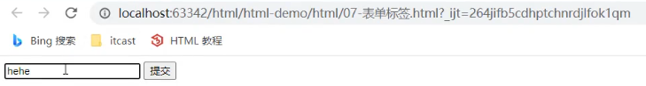 

在输入框输入 `hehe` ，然后点击 `提交` 按钮，就能看到如下效果

 

浏览器的地址栏的URL后拼接了提交的数据。`username` 就是输入框 `name` 属性值，而 `hehe` 就是在输入框输入的内容。

`method` 属性，默认是 `method = 'get'`，所以该取值就会将数据拼接到URL的后面。将 `method` 属性值设置为 `post`，浏览器的效果如下：

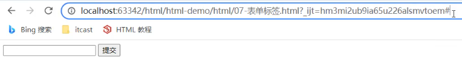 


### 表单项标签

表单项标签有很多，不同的表单项标签有不同的展示效果。表单项标签可以分为以下三个：

* \<input>：表单项，通过type属性控制输入形式

  `input` 标签有个 `type` 属性。 `type` 属性的取值不同，展示的效果也不一样

  

  

* \<select>：定义下拉列表，\<option> 定义列表项 

  如下图就是下拉列表的效果：

   

* \<textarea>：文本域

  文本域可以输入多行文本，而 `input` 数据框只能输入一行文本。


> ==注意：==
>
> * 以上标签项的内容要想提交，必须得定义 `name` 属性。
> * 每一个标签都有id属性，id属性值是唯一的标识。
> * 单选框、复选框、下拉列表需要使用 `value` 属性指定提交的值。


# CSS

### 概述

CSS 是一门语言，用于控制网页表现。网页由以下组成：

* 结构：HTML
* 表现：CSS
* 行为：JavaScript

CSS也有一个专业的名字：Cascading Style Sheet（层叠样式表）


### css 导入方式

css 导入方式其实就是 css 代码和 html 代码的结合方式。CSS 导入 HTML有三种方式：

* 内联样式：在标签内部使用style属性，属性值是css属性键值对

  ```html
  <div style="color: red">Hello CSS~</div>
  ```

  > 给方式只能作用在这一个标签上，如果其他的标签也想使用同样的样式，那就需要在其他标签上写上相同的样式。复用性太差。

* 内部样式：定义<style>标签，在标签内部定义css样式

  ```html
  <style type="text/css">
  	div{
  		color: red;
      }
  </style>
  ```

  > 这种方式可以做到在该页面中复用。

* 外部样式：定义link标签，引入外部的css文件

  编写一个css文件。名为：demo.css，内容如下:

  ```css
  div{
  	color: red;
  }
  ```

  在html中引入 css 文件。

  ```html
  <link rel="stylesheet"  href="demo.css">
  ```

  > 这种方式可以在多个页面进行复用。其他的页面想使用同样的样式，只需要使用 `link` 标签引入该css文件。

**代码演示：**

项目目录结构如下：


编写页面 `02-导入方式.html`，内容如下：

```html
<!DOCTYPE html>
<html lang="en">
<head>
    <meta charset="UTF-8">
    <title>Title</title>
    <style>
        span{
            color: red;
        }
    </style>
    <link href="../css/demo.css" rel="stylesheet">
</head>
<body>
    <div style="color: red">hello css</div>

    <span>hello css </span>

    <p>hello css</p>
</body>
</html>
```


### css 选择器

#### 元素选择器

（type 选择器 - 根据标签名进行匹配）

格式：

```css
元素名称{color: red;}
```

例子：

```
div {color:red}  /*该代码表示将页面中所有的div标签的内容的颜色设置为红色*/
```


#### id选择器

格式：

```css
#id属性值{color: red;}
```

例子：

html代码如下：

```html
<div id="name">hello css2</div>
```

css代码如下：

```css
#name{color: red;}/*该代码表示将页面中所有的id属性值是 name 的标签的内容的颜色设置为红色*/
```


#### 类选择器

格式：

```css
.class属性值{color: red;}
```

例子：

html代码如下：

```html
<div class="cls">hello css3</div>
```

css代码如下：

```css
.cls{color: red;} /*该代码表示将页面中所有的class属性值是 cls 的标签的内容的颜色设置为红色*/
```


### css 属性

* background-color : red;
* ...
* display

### css布局

与布局相关的 html 元素

* div
* template


# Javascript

## JavaScript基础语法

### 书写语法

* 区分大小写：与 Java 一样，变量名、函数名以及其他一切东西都是区分大小写的

* 每行结尾的分号可有可无

  如果一行上写多个语句时，必须加分号用来区分多个语句。

* 注释

  * 单行注释：// 注释内容
  * 多行注释：/* 注释内容 */

  > 注意：JavaScript 没有文档注释

* 大括号表示代码块

  下面语句大家肯定能看懂，和 java 一样 大括号表示代码块。

  ```js
  if (count == 3) { 
     alert(count); 
  } 
  ```

### 输出语句

js 可以通过以下方式进行内容的输出，只不过不同的语句输出到的位置不同

* **使用 window.alert() 写入警告框**

  ```html
  <!DOCTYPE html>
  <html lang="en">
  <head>
      <meta charset="UTF-8">
      <title>Title</title>
  </head>
  <body>
      
  <script>
      window.alert("hello js");//写入警告框
  </script>
  </body>
  </html>
  ```

  上面代码通过浏览器打开，我们可以看到如下图弹框效果

  

* **使用 document.write() 写入 HTML 输出**

  ```html
  <!DOCTYPE html>
  <html lang="en">
  <head>
      <meta charset="UTF-8">
      <title>Title</title>
  </head>
  <body>
      
  <script>
      document.write("hello js 2~");//写入html页面
  </script>
  </body>
  </html>
  ```

  上面代码通过浏览器打开，我们可以在页面上看到 `document.write(内容)` 输出的内容

  

* **使用 console.log() 写入浏览器控制台**

  ```html
  <!DOCTYPE html>
  <html lang="en">
  <head>
      <meta charset="UTF-8">
      <title>Title</title>
  </head>
  <body>
  
  <script>
      console.log("hello js 3");//写入浏览器的控制台
  </script>
  </body>
  </html>
  ```

  上面代码通过浏览器打开，我们可以在不能页面上看到  `console.log(内容)` 输出的内容，它是输出在控制台了，而怎么在控制台查看输出的内容呢？在浏览器界面按 `F12` 就可以看到下图的控制台

  

### 变量

JavaScript 中用 var 关键字（variable 的缩写）来声明变量。格式 `var 变量名 = 数据值;`。而在JavaScript 是一门弱类型语言，变量==可以存放不同类型的值==；如下在定义变量时赋值为数字数据，还可以将变量的值改为字符串类型的数

```js
var test = 20;
test = "张三";
```

js 中的变量名命名也有如下规则，和java语言基本都相同

* 组成字符可以是任何字母、数字、下划线（_）或美元符号（$）
* 数字不能开头
* 建议使用驼峰命名

JavaScript 中 `var` 关键字有点特殊，有以下地方和其他语言不一样

* 作用域：全局变量

  ```js
  {
      var age = 20;
  }
  alert(age);  // 在代码块中定义的age 变量，在代码块外边还可以使用
  ```

* 变量可以重复定义

  ```js
  {
      var age = 20;
      var age = 30;//JavaScript 会用 30 将之前 age 变量的 20 替换掉
  }
  alert(age); //打印的结果是 30
  ```

针对如上的问题，==ECMAScript 6 新增了 `let `关键字来定义变量。==它的用法类似于 `var`，但是所声明的变量，只在 `let` 关键字所在的代码块内有效，且不允许重复声明。

例如：

```js
{
    let age = 20;
}
alert(age); 
```

运行上面代码，浏览器并没有弹框输出结果，说明这段代码是有问题的。通过 `F12` 打开开发者模式可以看到如下错误信息


而如果在代码块中定义两个同名的变量，IDEA 开发工具就直接报错了

> 

==ECMAScript 6 新增了 const关键字，用来声明一个只读的常量。一旦声明，常量的值就不能改变。== 通过下面的代码看一下常用的特点就可以了

> 

我们可以看到给 PI 这个常量重新赋值时报错了。

### 数据类型

JavaScript 中提供了两类数据类型：原始类型 和 引用类型。

> 使用 typeof 运算符可以获取数据类型
>
> `alert(typeof age);` 以弹框的形式将 age 变量的数据类型输出

原始数据类型：

* **number**：数字（整数、小数、NaN(Not a Number)）

  ```js
  var age = 20;
  var price = 99.8;
  
  alert(typeof age); // 结果是 ： number
  alert(typeof price);// 结果是 ： number
  ```

  > ==注意：== NaN是一个特殊的number类型的值，后面用到再说

* **string**：字符、字符串，单双引皆可

  ```js
  var ch = 'a';
  var name = '张三'; 
  var addr = "北京";
  
  alert(typeof ch); //结果是  string
  alert(typeof name); //结果是  string
  alert(typeof addr); //结果是  string
  ```

  > ==注意：==在 js 中 双引号和单引号都表示字符串类型的数据

* **boolean**：布尔。true，false

  ```js
  var flag = true;
  var flag2 = false;
  
  alert(typeof flag); //结果是 boolean
  alert(typeof flag2); //结果是 boolean
  ```

* **null**：对象为空

  ```js
  var obj = null;
  
  alert(typeof obj);//结果是 object
  ```

  为什么打印上面的 obj 变量的数据类型，结果是object；这个官方给出了解释，下面是从官方文档截的图

  

* **undefined**：当声明的变量未初始化时，该变量的默认值是 undefined

  ```js
  var a ;
  alert(typeof a); //结果是 undefined
  ```

### 运算符

JavaScript 提供了如下的运算符。大部分和 Java语言 都是一样的，不同的是 JS 关系运算符中的 `==` 和 `===`，一会我们只演示这两个的区别，其他运算符将不做演示

* 一元运算符：++，--

* 算术运算符：+，-，*，/，%

* 赋值运算符：=，+=，-=…

* 关系运算符：>，<，>=，<=，!=，\==，===…

* 逻辑运算符：&&，||，!

* 三元运算符：条件表达式 ? true_value : false_value 

#### ==和===区别

**概述:**

* ==：

  1. 判断类型是否一样，如果不一样，则进行类型转换

  2. 再去比较其值

* ===：js 中的全等于

  1. 判断类型是否一样，如果不一样，直接返回false
  2. 再去比较其值

**代码：**

```js
var age1 = 20;
var age2 = "20";

alert(age1 == age2);// true
alert(age1 === age2);// false
```

####  类型转换

上述讲解 `==` 运算符时，发现会进行类型转换，所以接下来我们来详细的讲解一下 JavaScript 中的类型转换。

* 其他类型转为number

  * string 转换为 number 类型：按照字符串的字面值，转为数字。如果字面值不是数字，则转为NaN

    将 string 转换为 number 有两种方式：

    * 使用 `+` 正号运算符：

      ```js
      var str = +"20";
      alert(str + 1) //21
      ```

    * 使用 `parseInt()` 函数(方法)：

      ```js
      var str = "20";
      alert(parseInt(str) + 1);
      ```

    > ==建议使用 `parseInt()` 函数进行转换。==

  * boolean 转换为 number 类型：true 转为1，false转为0

    ```js
    var flag = +false;
    alert(flag); // 0
    ```

* 其他类型转为boolean

  * number 类型转换为 boolean 类型：0和NaN转为false，其他的数字转为true
  * string 类型转换为 boolean 类型：空字符串转为false，其他的字符串转为true
  * null类型转换为 boolean 类型是 false
  * undefined 转换为 boolean 类型是 false

  **代码如下：**

  ```js
  // var flag = 3;
  // var flag = "";
  var flag = undefined;
  
  if(flag){
      alert("转为true");
  }else {
      alert("转为false");
  }
  ```

**使用场景：**

在 Java 中使用字符串前，一般都会先判断字符串不是null，并且不是空字符才会做其他的一些操作，JavaScript也有类型的操作，代码如下：

```js
var str = "abc";

//健壮性判断
if(str != null && str.length > 0){
    alert("转为true");
}else {
    alert("转为false");
}
```

但是由于 JavaScript 会自动进行类型转换，所以上述的判断可以进行简化，代码如下：

```js
var str = "abc";

//健壮性判断
if(str){
    alert("转为true");
}else {
    alert("转为false");
}
```


### 流程控制语句

JavaScript 中提供了和 Java 一样的流程控制语句，如下

* if 
* switch
* for
* while
* dowhile

#### if 语句

```js
var count = 3;
if (count == 3) {
    alert(count);
}
```

#### switch 语句

```js
var num = 3;
switch (num) {
    case 1:
        alert("星期一");
        break;
    case 2:
        alert("星期二");
        break;
    case 3:
        alert("星期三");
        break;
    case 4:
        alert("星期四");
        break;
    case 5:
        alert("星期五");
        break;
    case 6:
        alert("星期六");
        break;
    case 7:
        alert("星期日");
        break;
    default:
        alert("输入的星期有误");
        break;
}
```

#### for 循环语句

```js
var sum = 0;
for (let i = 1; i <= 100; i++) { //建议for循环小括号中定义的变量使用let
    sum += i;
}
alert(sum);
```

#### while 循环语句

```js
var sum = 0;
var i = 1;
while (i <= 100) {
    sum += i;
    i++;
}
alert(sum);
```

#### dowhile 循环语句

```js
var sum = 0;
var i = 1;
do {
    sum += i;
    i++;
}
while (i <= 100);
alert(sum);
```


### 函数

函数（就是Java中的方法）是被设计为执行特定任务的代码块；JavaScript 函数通过 function 关键词进行定义。

#### 定义格式

函数定义格式有两种：

* 方式1

  ```js
  function 函数名(参数1,参数2..){
      要执行的代码
  }
  ```

* 方式2

  ```js
  var 函数名 = function (参数列表){
      要执行的代码
  }
  ```

> ==注意：==
>
> * 形式参数不需要类型。因为JavaScript是弱类型语言
>
>   ```js
>   function add(a, b){
>       return a + b;
>   }
>   ```
>
>   上述函数的参数 a 和 b 不需要定义数据类型，因为在每个参数前加上 var 也没有任何意义。
>
> * 返回值也不需要定义类型，可以在函数内部直接使用return返回即可

#### 函数调用

函数调用函数：

```js
函数名称(实际参数列表);
```

eg：

```js
let result = add(10,20);
```

> ==注意：==
>
> * JS中，函数调用可以传递任意个数参数
>
> * 例如  `let result = add(1,2,3);` 
>
>   它是将数据 1 传递给了变量a，将数据 2 传递给了变量 b，而数据 3 没有变量接收。


## JavaScript常用对象

JavaScript 提供了很多对象供使用者来使用。这些对象总共分类三类

* 基本对象

* BOM 对象

* DOM对象


### Array对象

JavaScript Array对象用于定义数组

#### 定义格式

数组的定义格式有两种：

* 方式1

  ```js
  var 变量名 = new Array(元素列表); 
  ```

  例如：

  ```js
  var arr = new Array(1,2,3); //1,2,3 是存储在数组中的数据（元素）
  ```

* 方式2

  ```js
  var 变量名 = [元素列表];
  ```

  例如：

  ```js
  var arr = [1,2,3]; //1,2,3 是存储在数组中的数据（元素）
  ```

  ==注意：Java中的数组静态初始化使用的是{}定义，而 JavaScript 中使用的是 [] 定义==

#### 元素访问

访问数组中的元素和 Java 语言的一样，格式如下：

```js
arr[索引] = 值;
```

**代码演示：**

```js
 // 方式一
var arr = new Array(1,2,3);
// alert(arr);

// 方式二
var arr2 = [1,2,3];
//alert(arr2);

// 访问
arr2[0] = 10;
alert(arr2)
```

#### 特点

JavaScript 中的数组相当于 Java 中集合。数组的长度是可以变化的，而 JavaScript 是弱类型，所以可以存储任意的类型的数据。

例如如下代码：

```js
// 变长
var arr3 = [1,2,3];
arr3[10] = 10;
alert(arr3[10]); // 10
alert(arr3[9]);  //undefined
```

上面代码在定义数组中给了三个元素，又给索引是 10 的位置添加了数据 10，那么 `索引3` 到 `索引9` 位置的元素是什么呢？我们之前就介绍了，在 JavaScript 中没有赋值的话，默认就是 `undefined`。

如果给 `arr3` 数组添加字符串的数据，也是可以添加成功的

```js
arr3[5] = "hello";
alert(arr3[5]); // hello
```

#### 属性

Array 对象提供了很多属性，如下图是官方文档截取的


而我们只讲解 `length` 属性，该数组可以动态的获取数组的长度。而有这个属性，我们就可以遍历数组了

```js
var arr = [1,2,3];
for (let i = 0; i < arr.length; i++) {
    alert(arr[i]);
}
```

#### 方法

Array 对象同样也提供了很多方法，如下图是官方文档截取的


而我们在课堂中只演示 `push` 函数和 `splice` 函数。

* push 函数：给数组添加元素，也就是在数组的末尾添加元素

  参数表示要添加的元素

  ```js
  // push:添加方法
  var arr5 = [1,2,3];
  arr5.push(10);
  alert(arr5);  //数组的元素是 {1,2,3,10}
  ```

* splice 函数：删除元素

  参数1：索引。表示从哪个索引位置删除

  参数2：个数。表示删除几个元素

  ```js
  // splice:删除元素
  var arr5 = [1,2,3];
  arr5.splice(0,1); //从 0 索引位置开始删除，删除一个元素 
  alert(arr5); // {2,3}
  ```

### String对象

String对象的创建方式有两种

* 方式1：

  ```js
  var 变量名 = new String(s); 
  ```

* 方式2：

  ```js
  var 变量名 = "数组"; 
  ```

**属性：**

String对象提供了很多属性，下面给大家列举了一个属性 `length` ，该属性是用于动态的获取字符串的长度


**函数：**

String对象提供了很多函数（方法），下面给大家列举了两个方法。


String对象还有一个函数 `trim()` ，该方法在文档中没有体现，但是所有的浏览器都支持；它是用来去掉字符串两端的空格。

代码演示：

```js
var str4 = '  abc   ';
alert(1 + str4 + 1);
```

上面代码会输出内容 `1  abc  1`，很明显可以看到 abc 字符串左右两边是有空格的。接下来使用 `trim()` 函数

```js
var str4 = '  abc   ';
alert(1 + str4.trim() + 1);
```

输出的内容是 `1abc1` 。这就是 `trim()` 函数的作用。


### 自定义对象

在 JavaScript 中自定义对象特别简单，下面就是自定义对象的格式：

```js
var 对象名称 = {
    属性名称1:属性值1,
    属性名称2:属性值2,
    ...,
    函数名称:function (形参列表){},
	...
};
```

调用属性的格式：

```js
对象名.属性名
```

调用函数的格式：

```js
对象名.函数名()
```

接下来通过代码演示一下，让大家体验一下 JavaScript 中自定义对象

```js
var person = {
        name : "zhangsan",
        age : 23,
        eat: function (){
            alert("干饭~");
        }
    };


alert(person.name);  //zhangsan
alert(person.age); //23

person.eat();  //干饭~
```


## BOM

BOM：Browser Object Model 浏览器对象模型。也就是 JavaScript 将浏览器的各个组成部分封装为对象。

我们要操作浏览器的各个组成部分就可以通过操作 BOM 中的对象来实现。比如：我现在想将浏览器地址栏的地址改为 `https://www.itheima.com` 就可以通过使用 BOM 中定义的 `Location` 对象的 `href` 属性，代码： `location.href = "https://itheima.com";` 

 BOM 中包含了如下对象：

* Window：浏览器窗口对象
* Navigator：浏览器对象
* Screen：屏幕对象
* History：历史记录对象
* Location：地址栏对象

下图是 BOM 中的各个对象和浏览器的各个组成部分的对应关系

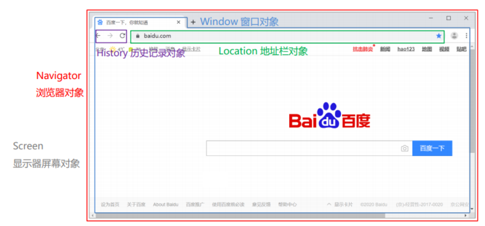

BOM 中的 `Navigator` 对象和 `Screen` 对象基本不会使用，所以我们的课堂只对 `Window`、`History`、`Location` 对象进行讲解。

### Window对象

window 对象是 JavaScript 对浏览器的窗口进行封装的对象。

#### 获取window对象

该对象不需要创建直接使用 `window`，其中 `window. ` 可以省略。比如我们之前使用的 `alert()` 函数，其实就是 `window` 对象的函数，在调用是可以写成如下两种

* 显式使用 `window` 对象调用

  ```js
  window.alert("abc");
  ```

* 隐式调用

  ```
  alert("abc")
  ```

#### window对象属性

`window` 对象提供了用于获取其他 BOM 组成对象的属性


也就是说，我们想使用 `Location` 对象的话，就可以使用 `window` 对象获取；写成 `window.location`，而 `window.` 可以省略，简化写成 `location` 来获取 `Location` 对象。

#### window对象函数

`window` 对象提供了很多函数供我们使用，而很多都不常用；下面给大家列举了一些比较常用的函数


> `setTimeout(function,毫秒值)` : 在一定的时间间隔后执行一个function，只执行一次
> `setInterval(function,毫秒值)` :在一定的时间间隔后执行一个function，循环执行

**confirm代码演示：**

```js
// confirm()，点击确定按钮，返回true，点击取消按钮，返回false
var flag = confirm("确认删除？");

alert(flag);
```

下图是 `confirm()` 函数的效果。当我们点击 `确定` 按钮，`flag` 变量值记录的就是 `true` ；当我们点击 `取消` 按钮，`flag` 变量值记录的就是 `false`。


而以后我们在页面删除数据时候如下图每一条数据后都有 `删除` 按钮，有可能是用户的一些误操作，所以对于删除操作需要用户进行再次确认，此时就需要用到 `confirm()` 函数。


**定时器代码演示：**

```js
setTimeout(function (){
    alert("hehe");
},3000);
```


### History对象

History 对象是 JavaScript 对历史记录进行封装的对象。

* History 对象的获取

  使用 window.history获取，其中window. 可以省略

* History 对象的函数

  

  这两个函数我们平时在访问其他的一些网站时经常使用对应的效果，如下图

  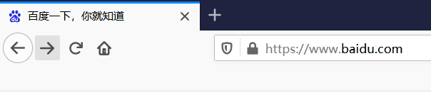

  当我们点击向左的箭头，就跳转到前一个访问的页面，这就是 `back()` 函数的作用；当我们点击向右的箭头，就跳转到下一个访问的页面，这就是 `forward()` 函数的作用。

### Location对象


Location 对象是 JavaScript 对地址栏封装的对象。可以通过操作该对象，跳转到任意页面。

#### 获取Location对象

使用 window.location获取，其中window. 可以省略

```js
window.location.方法();
location.方法();
```


#### Location对象属性

Location对象提供了很对属性。以后常用的只有一个属性 `href`

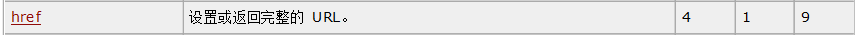

**代码演示：**

```js
alert("要跳转了");
location.href = "https://www.baidu.com";
```

在浏览器首先会弹框显示 `要跳转了`，当我们点击了 `确定` 就会跳转到 百度 的首页。


## DOM

### 概述

DOM：Document Object Model 文档对象模型。也就是 JavaScript 将 HTML 文档的各个组成部分封装为对象。

封装的对象分为：

* Document：整个文档对象
* Element：元素对象
* Attribute：属性对象
* Text：文本对象
* Comment：注释对象

如下图，左边是 HTML 文档内容，右边是 DOM 树


**作用：**

JavaScript 通过 DOM， 就能够对 HTML进行操作了

* 改变 HTML 元素的内容
* 改变 HTML 元素的样式（CSS）
* 对 HTML DOM 事件作出反应
* 添加和删除 HTML 元素

**DOM相关概念：**

DOM 是 W3C（万维网联盟）定义了访问 HTML 和 XML 文档的标准。该标准被分为 3 个不同的部分：

1. 核心 DOM：针对任何结构化文档的标准模型。 XML 和 HTML 通用的标准

   * Document：整个文档对象

   * Element：元素对象

   * Attribute：属性对象

   * Text：文本对象

   * Comment：注释对象

2. XML DOM： 针对 XML 文档的标准模型

3. HTML DOM： 针对 HTML 文档的标准模型

   该标准是在核心 DOM 基础上，对 HTML 中的每个标签都封装成了不同的对象

   * 例如：`` 标签在浏览器加载到内存中时会被封装成 `Image` 对象，同时该对象也是 `Element` 对象。
   * 例如：`<input type='button'>` 标签在浏览器加载到内存中时会被封装成 `Button` 对象，同时该对象也是 `Element` 对象。

### 获取 Element对象

HTML 中的 Element 对象可以通过 `Document` 对象获取，而 `Document` 对象是通过 `window` 对象获取。

`Document` 对象中提供了以下获取 `Element` 元素对象的函数

* `getElementById()`：根据id属性值获取，返回单个Element对象
* `getElementsByTagName()`：根据标签名称获取，返回Element对象数组
* `getElementsByName()`：根据name属性值获取，返回Element对象数组
* `getElementsByClassName()`：根据class属性值获取，返回Element对象数组


### 事件绑定

JavaScript 提供了两种事件绑定方式：

* 方式一：通过 HTML标签中的事件属性进行绑定

  如下面代码，有一个按钮元素，我们是在该标签上定义 `事件属性`，在事件属性中绑定函数。`onclick` 就是 `单击事件` 的事件属性。`onclick='on（）'` 表示该点击事件绑定了一个名为 `on()` 的函数

  ```html
  <input type="button" onclick='on()’>
  ```

  下面是点击事件绑定的 `on()` 函数

  ```js
  function on(){
  	alert("我被点了");
  }
  ```

* 方式二：通过 DOM 元素属性绑定

  如下面代码是按钮标签，在该标签上我们并没有使用 `事件属性`，绑定事件的操作需要在 js 代码中实现

  ```html
  <input type="button" id="btn">
  ```

  下面 js 代码是获取了 `id='btn'` 的元素对象，然后将 `onclick` 作为该对象的属性，并且绑定匿名函数。该函数是在事件触发后自动执行

  ```js
  document.getElementById("btn").onclick = function (){
      alert("我被点了");
  }
  ```

**代码演示：**

```html
<!DOCTYPE html>
<html lang="en">
<head>
    <meta charset="UTF-8">
    <title>Title</title>
</head>
<body>
    <!--方式1：在下面input标签上添加 onclick 属性，并绑定 on() 函数-->
    <input type="button" value="点我" onclick="on()"> <br>
    <input type="button" value="再点我" id="btn">

    <script>
        function on(){
            alert("我被点了");
        }
      	//方式2：获取 id="btn" 元素对象，通过调用 onclick 属性 绑定点击事件
        document.getElementById("btn").onclick = function (){
            alert("我被点了");
        }
    </script>
</body>
</html>
```

### 常见事件

| 事件属性名  | 说明                     |
| ----------- | ------------------------ |
| onclick     | 鼠标单击事件             |
| onblur      | 元素失去焦点             |
| onfocus     | 元素获得焦点             |
| onload      | 某个页面或图像被完成加载 |
| onsubmit    | 当表单提交时触发该事件   |
| onmouseover | 鼠标被移到某元素之上     |
| onmouseout  | 鼠标从某元素移开         |


Vue 使用起来是比较简单的，总共分为如下三步：

1. **新建 HTML 页面，引入 Vue.js文件**

   ```html
   <script src="js/vue.js"></script>
   ```

2. **在JS代码区域，创建Vue核心对象，进行数据绑定**

   ```js
   new Vue({
       el: "#app",
       data() {
           return {
               username: ""
           }
       }
   });
   ```

   创建 Vue 对象时，需要传递一个 js 对象，而该对象中需要如下属性：

   * `el` ： 用来指定哪儿些标签受 Vue 管理。 该属性取值 `#app` 中的 `app` 需要是受管理的标签的id属性值
   * `data` ：用来定义数据模型
   * `methods` ：用来定义函数。这个我们在后面就会用到

3. **编写视图**

   ```html
   <div id="app">
       <input name="username" v-model="username" >
       {{username}}
   </div>
   ```

   `{{}}` 是 Vue 中定义的 `插值表达式` ，在里面写数据模型，到时候会将该模型的数据值展示在这个位置。

**整体代码如下：**

```html
<!DOCTYPE html>
<html lang="en">
<head>
    <meta charset="UTF-8">
    <title>Title</title>
</head>
<body>
<div id="app">
    <input v-model="username">
    <!--插值表达式-->
    {{username}}
</div>
<script src="js/vue.js"></script>
<script>
    //1. 创建Vue核心对象
    new Vue({
        el:"#app",
        data(){  // data() 是 ECMAScript 6 版本的新的写法
            return {
                username:""
            }
        }

        /*data: function () {
            return {
                username:""
            }
        }*/
    });

</script>
</body>
</html>
```


# Vue

## Vue 指令

**指令：**HTML 标签上带有 v- 前缀的特殊属性，不同指令具有不同含义。例如：v-if，v-for…

常用的指令有：

| **指令**  | **作用**                                            |
| --------- | --------------------------------------------------- |
| v-bind    | 为HTML标签绑定属性值，如设置  href , css样式等      |
| v-model   | 在表单元素上创建双向数据绑定                        |
| v-on      | 为HTML标签绑定事件                                  |
| v-if      | 条件性的渲染某元素，判定为true时渲染,否则不渲染     |
| v-else    |                                                     |
| v-else-if |                                                     |
| v-show    | 根据条件展示某元素，区别在于切换的是display属性的值 |
| v-for     | 列表渲染，遍历容器的元素或者对象的属性              |

接下来我们挨个学习这些指令

#### v-bind & v-model 指令


* **v-bind**

  该指令可以给标签原有属性绑定模型数据。这样模型数据发生变化，标签属性值也随之发生变化

  例如：

  ```html
  <a v-bind:href="url">百度一下</a>
  ```

  上面的 `v-bind:"`  可以简化写成 `:`  ，如下：

  ```html
  <!--
  	v-bind 可以省略
  -->
  <a :href="url">百度一下</a>
  ```

* **v-model**

  该指令可以给表单项标签绑定模型数据。这样就能实现双向绑定效果。例如：

  ```html
  <input name="username" v-model="username">
  ```

**代码演示：**

```html
<!DOCTYPE html>
<html lang="en">
<head>
    <meta charset="UTF-8">
    <title>Title</title>
</head>
<body>
<div id="app">
    <a v-bind:href="url">点击一下</a>
    <a :href="url">点击一下</a>
    <input v-model="url">
</div>

<script src="js/vue.js"></script>
<script>
    //1. 创建Vue核心对象
    new Vue({
        el:"#app",
        data(){
            return {
                username:"",
                url:"https://www.baidu.com"
            }
        }
    });
</script>
</body>
</html>
```

通过浏览器打开上面页面，并且使用检查查看超链接的路径，该路径会根据输入框输入的路径变化而变化，这是因为超链接和输入框绑定的是同一个模型数据


#### v-on 指令


我们在页面定义一个按钮，并给该按钮使用 `v-on` 指令绑定单击事件，html代码如下

```html
<input type="button" value="一个按钮" v-on:click="show()">
```

而使用 `v-on` 时还可以使用简化的写法，将 `v-on:` 替换成 `@`，html代码如下

```html
<input type="button" value="一个按钮" @click="show()">
```

上面代码绑定的 `show()` 需要在 Vue 对象中的 `methods` 属性中定义出来

```js
new Vue({
    el: "#app",
    methods: {
        show(){
            alert("我被点了");
        }
    }
});
```

> ==注意：`v-on:` 后面的事件名称是之前原生事件属性名去掉on。==
>
> 例如：
>
> * 单击事件 ： 事件属性名是 onclick，而在vue中使用是 `v-on:click`
> * 失去焦点事件：事件属性名是 onblur，而在vue中使用时 `v-on:blur`


#### 条件判断指令


接下来通过代码演示一下。在 Vue中定义一个 `count` 的数据模型，如下

```js
//1. 创建Vue核心对象
new Vue({
    el:"#app",
    data(){
        return {
            count:3
        }
    }
});
```

现在要实现，当 `count` 模型的数据是3时，在页面上展示 `div1` 内容；当 `count` 模型的数据是4时，在页面上展示 `div2` 内容；`count` 模型数据是其他值时，在页面上展示 `div3`。这里为了动态改变模型数据 `count` 的值，再定义一个输入框绑定 `count` 模型数据。html 代码如下：

```html
<div id="app">
    <div v-if="count == 3">div1</div>
    <div v-else-if="count == 4">div2</div>
    <div v-else>div3</div>
    <hr>
    <input v-model="count">
</div>
```


#### v-for 指令

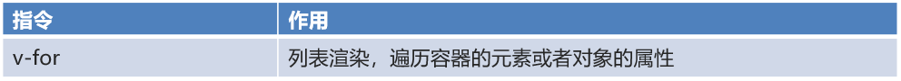

这个指令看到名字就知道是用来遍历的，该指令使用的格式如下：

```html
<标签 v-for="变量名 in 集合模型数据">
    {{变量名}}
</标签>
```

> ==注意：需要循环那个标签，`v-for` 指令就写在那个标签上。==

如果在页面需要使用到集合模型数据的索引，就需要使用如下格式：

```html
<标签 v-for="(变量名,索引变量) in 集合模型数据">
    <!--索引变量是从0开始，所以要表示序号的话，需要手动的加1-->
   {{索引变量 + 1}} {{变量名}}
</标签>
```


##  生命周期 

生命周期的八个阶段：每触发一个生命周期事件，会自动执行一个生命周期方法，这些生命周期方法也被称为钩子方法。

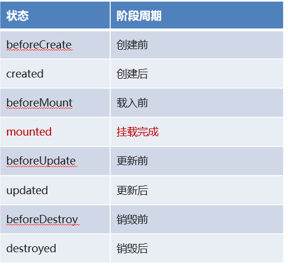

下图是 Vue 官网提供的从创建 Vue 到效果 Vue 对象的整个过程及各个阶段对应的钩子函数


`mounted`：挂载完成，Vue初始化成功，HTML页面渲染成功。而以后我们会在该方法中发送异步请求，加载数据。

### 
